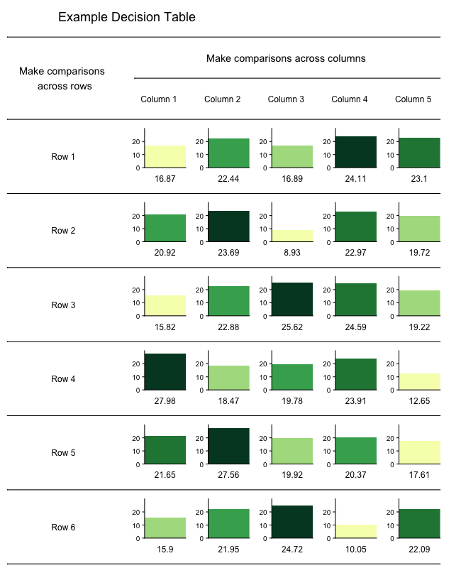
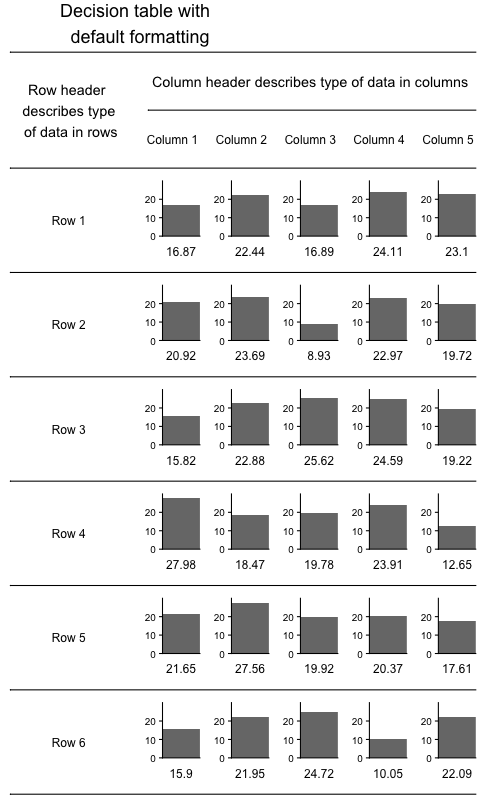

<!-- README.md is generated from README.Rmd. Please edit that file -->

```{r, include = FALSE}
knitr::opts_chunk$set(
  collapse = TRUE,
  comment = "#>",
  fig.path = "man/figures/README-",
  out.width = "100%"
)
```

# decisiontable

<!-- badges: start -->
<!-- badges: end -->

The goal of decisiontable is to combine text-based tables with graphical elements to produce flexible decision table visualizations that convey trade-offs and are easily reproduced. The package leverages bar plots, coloring options, layout choices, and optional summary information to highlight and display trade-offs.
```{r include=FALSE}
# Should have same code as below, evaluated but not included in Rmd output
library(decisiontable)

# Example data
set.seed(1)
data_df <- matrix(c(abs(rnorm(30,20,sd=5))), ncol = 5, nrow = 6)
colnames(data_df) <- c("Column 1", "Column 2", "Column 3", "Column 4", "Column 5")
rownames(data_df) <- c("Row 1", "Row 2", "Row 3", "Row 4", "Row 5", "Row 6")

makeDecisionTable(data = data_df,
                  BestPerformanceVector = rep("High", nrow(data_df)),
                  barColors = "defaultRankColor",
                  visualRank = "TRUE",
                  OutputFileName = "Readme_Fig1",
                  GraphicTitle = "Example Decision Table",
                  RowHeader = "Make comparisons \n across rows",
                  ColumnHeader = "Make comparisons across columns",
                  figureWidth = 650,
                  figureHeight = 800)
```



## Installation

<!--You can install the released version of decisiontable from [CRAN](https://CRAN.R-project.org) with:

``` r
install.packages("decisiontable", build_vignettes = TRUE)
```

And the development version from [GitHub](https://github.com/) with:
-->
You can install the development version of decisiontable from [GitHub](https://github.com/) with:

``` r
# install.packages("devtools")
devtools::install_github("ahart1/decisiontable")
```
## Usage

The `makeDecisionTable()` function is the powerhouse of this package. With it bar plots are used to visually display more traditional text information, coloring can be altered, figure dimensions and layout can be customized, and summary statistics can be calculated and appended to the resulting decision table figure.

Most simply, default function settings can be used to produce a decision table figure where bar chart height coresponds to the printed values along the x-axis of each plot and row and column labels are pulled from the input dataframe. Only the output file name, title, and row headers need be specified to produce an informative decision table. The figure will automatically be stored as a .png file in your current working directory.

```{r echo='TRUE'}
library(decisiontable)

# Here is an example dataframe
set.seed(1)
data_df <- matrix(c(abs(rnorm(30,20,sd=5))), ncol = 5, nrow = 6)
colnames(data_df) <- c("Column 1", "Column 2", "Column 3", "Column 4", "Column 5")
rownames(data_df) <- c("Row 1", "Row 2", "Row 3", "Row 4", "Row 5", "Row 6")


# Produce a simple decision table figure using default formatting and minimal input
makeDecisionTable(data = data_df,
                  OutputFileName = "Readme_Fig2",
                  GraphicTitle = "Decision table with \n default formatting",
                  RowHeader = "Row header \n describes type \n of data in rows",
                  ColumnHeader = "Column header describes type of data in columns")
```


To get an introduction to other features of the package, read the [introductory vignette](https://github.com/ahart1/decisiontable/blob/master/vignettes/decisiontable.html). 


